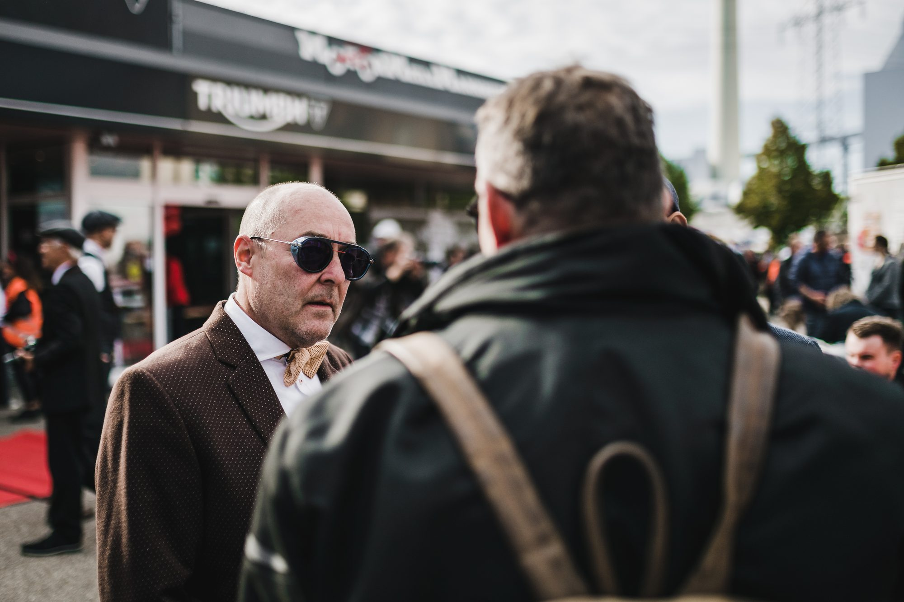

# shidhartha.de MEDIA — Photography

Live at: https://shidharthade.github.io/Photography-Portfolio/

Files: `index.html`, `styles.css`, `script.js`. Gallery is wired up with 75 photos from `images/`.

## Branding

The site uses the "shidhartha.de MEDIA" brand (wordmark, favicons, colors, fonts), sourced from a separate brand kit and copied into the `brand/` folder and the repo root:

- `brand/logo_wordmark.svg` — header/imprint logo (light-background wordmark variant).
- `brand/og-image.png` — social share preview image (Open Graph/Twitter).
- `favicon_dark-box.*` / `favicon_white-box.*` (svg/ico/png at several sizes) — favicon set that automatically switches with the visitor's light/dark mode preference (`prefers-color-scheme`), plus a universal `favicon.ico` fallback.
- Typeface: [Urbanist](https://fonts.google.com/specimen/Urbanist) (Google Fonts), loaded site-wide.
- Accent color: `#D40000` (Rosso corsa red) — set as the `--accent` CSS variable in `styles.css`, used on the active filter tab, the enquiry submit button, link hovers, and the contact email underline.
- The hero section has a one-time animated "camera focus-pull" SVG intro (plays once on load, respects `prefers-reduced-motion`).

To update any brand asset later (e.g. a new logo variant), replace the corresponding file in `brand/` or the favicon files at the repo root — filenames are referenced directly in `index.html` and `imprint.html`, so keep names the same or update the `<link>`/`` tags accordingly.

Legal note: `imprint.html`'s Impressum/Datenschutz content intentionally still uses the real legal name (not the brand name) where German law requires it — see "Imprint & Privacy page" below.

## Image folders

- `images/` — web-optimized copies (max ~2000px wide, ~280KB avg) used by the live site. This is the only image folder that gets pushed to GitHub.
- `images-original/` — full camera-resolution originals, kept locally as a backup. Excluded via `.gitignore`, never pushed.

To add more photos: drop the full-res file in `images-original/`, create a resized/compressed copy in `images/` (same filename), then add a `<figure>` tile for it in the gallery grid in `index.html`.

To swap the About section photo: replace `<div class="placeholder-img about-photo"></div>` in `index.html` with an `` tag pointing at a photo in `images/`.

## Gallery categories

The gallery has filter tabs: All, Wedding, Old Timers, Events, Motorsport. A photo shows up under a category once you tag it — add `data-category="..."` to its `<figure>` tag, e.g.:

```html
<figure class="gallery-item" data-category="wedding">
  
</figure>
```

Valid values: `wedding`, `old-timers`, `events`, `motorsport`. A photo can only carry one category right now. Untagged photos (all 75 current ones, for now) only show up under "All" — that's expected until you sort them. If a category tab has no tagged photos yet, the gallery shows a "No photos in this category yet" message instead of an empty grid.

To add a brand-new category: duplicate one of the `<button class="filter-tab" data-filter="...">` lines in the gallery section of `index.html` with a new filter name, and use that same name in photos' `data-category`.

## Update the bio text

Edit the paragraphs inside `<div class="about-text">` in `index.html` with your real bio.

## Analytics setup (one-time)

The site is wired for [GoatCounter](https://www.goatcounter.com) — free, privacy-friendly (no cookies, no GDPR consent banner needed), and it tracks both page visits and individual link/photo clicks.

1. Go to goatcounter.com → **Sign up** (just an email, no credit card). Pick a site code, e.g. `shidharthade` → your dashboard will be `https://shidharthade.goatcounter.com`.
2. Verify via the emailed magic link.
3. In `index.html`, find the line near the bottom:
   ```html
   <script data-goatcounter="https://YOURCODE.goatcounter.com/count" async src="//gc.zgo.at/count.js"></script>
   ```
   Replace `YOURCODE` with the site code you picked.
4. Push. Visits start appearing in your GoatCounter dashboard within seconds.

### What's already tracked

- **Page visits** — automatic, no extra work.
- **Photo clicks** — each gallery photo fires an event named `photo-1`, `photo-2`, etc. (matches the `Photo N` caption) when clicked/opened in the lightbox.
- **Link clicks** — `contact-email`, `social-instagram`, `social-linkedin` track clicks on those respectively.

All of this shows up under the "Campaigns" / events view in the GoatCounter dashboard, alongside regular page views.

## Enquiry form setup (Supabase, one-time)

The Contact section has a project-enquiry form (name, email, phone, project type, event date, location, budget, message) that saves submissions to a free Supabase database — not just a mailto link. Setup:

### 1. Create the project

1. Go to [supabase.com](https://supabase.com) → **Sign up** (free, no credit card).
2. **New project** → pick an organization, name it (e.g. `photography-portfolio`), set a database password (save it somewhere), and — important for GDPR — choose a **region in the EU** (e.g. Frankfurt).
3. Wait ~2 minutes for the project to spin up.

### 2. Create the table

In the dashboard, go to **SQL Editor** → **New query**, paste this, and run it:

```sql
create table public.enquiries (
  id uuid primary key default gen_random_uuid(),
  created_at timestamptz not null default now(),
  name text not null,
  email text not null,
  phone text,
  project_type text,
  event_date date,
  location text,
  budget_range text,
  message text not null
);

-- Lock the table down: the public site can only INSERT, never read/edit/delete.
alter table public.enquiries enable row level security;

create policy "Public can submit enquiries"
on public.enquiries
for insert
to anon
with check (true);

grant insert on public.enquiries to anon;
```

This means the API key embedded in your public site can only add new rows — it can't be used to read, change, or delete anyone's data. You'll view submissions yourself by logging into the Supabase dashboard (**Table Editor** → `enquiries`), which uses your own login, not the public key.

### 3. Connect the site

1. In the dashboard, go to **Project Settings → API**.
2. Copy the **Project URL** and the **anon / publishable** key (not the `service_role` key — never put that one in a public site).
3. In `script.js`, find these two lines near the bottom:
   ```js
   const SUPABASE_URL = 'https://YOUR-PROJECT.supabase.co';
   const SUPABASE_KEY = 'YOUR-PUBLISHABLE-KEY';
   ```
   Replace both with your actual values.
4. Push. Submitting the form on the live site should now add a row in **Table Editor → enquiries**.

### Anti-spam

The form has a hidden "Company" field (a honeypot) — real visitors never see or fill it, but bots often fill every field automatically. If it's filled in, the form pretends to succeed without actually saving anything, so spam is silently dropped.

### Feeding the future cost calculator

Because this is a real Postgres database (not just an inbox), the cost-calculation tool can later read from `enquiries` directly, or write its own tables (e.g. pricing rules, computed quotes) into the same Supabase project — no migration needed when that gets built.

## Imprint & Privacy page (Germany/GDPR)

`imprint.html` is a German-law Impressum + Datenschutzerklärung (with a non-binding English summary), linked from the site footer. It's a **draft, not ready to publish**:

1. Open `imprint.html` and replace every `[bracketed placeholder]` — your full legal name, address, phone number, and (if applicable) VAT ID.
2. Fill in the date at "Stand: [Datum einfügen]".
3. Have it reviewed by a lawyer (Fachanwalt für IT-Recht/Datenschutzrecht) before the site goes live — an Impressum is legally required in Germany for most non-purely-private sites, and getting the details wrong (or skipping it) carries real legal risk (Abmahnung).
4. Once filled in, remove the yellow "Placeholder content" notice box at the top of the page.

It already covers hosting on GitHub Pages and the GoatCounter analytics as data processors — if you swap either of those out later, update those sections too.

## SEO

What's already in place:

- Descriptive page title, meta description, and canonical URL, all naming the six categories.
- Open Graph + Twitter Card tags, so links shared on social media/Instagram bio show a proper preview image and description.
- JSON-LD structured data (`Person` schema) listing your services and social profiles — helps Google understand what the site is about.
- `robots.txt` and `sitemap.xml` at the site root (`imprint.html` is deliberately excluded from the sitemap via its `noindex` tag — that's correct, it's not meant to rank).
- `width`/`height` attributes on every gallery image, so the page doesn't jump around as images load (a Google Core Web Vitals signal).
- A short category blurb under each filter tab (visible when that tab is active) so Google has real text to index per category, not just photos — since the site is one page with tabs rather than separate pages per category, this is what lets it still rank for category-specific searches.

What still needs your input:

- **Location**: none of the copy currently names a city/region (the meta description and JSON-LD just say "Germany"). Local search (e.g. "wedding photographer in [city]") ranks heavily on location text — once you're comfortable publishing one (doesn't have to be your home address, just a city/service area), add it to the meta description, the JSON-LD (`"areaServed"`), and the category blurbs in `index.html`.
- **Alt text**: gallery images currently use generic alt text (`Photo 1`, `Photo 2`, ...) — as you tag photos with `data-category` (see "Gallery categories" above), also rewrite each photo's `alt` attribute to actually describe it (e.g. `alt="Bride and groom outdoor wedding ceremony"`). Descriptive alt text is one of the bigger factors in Google Image Search ranking.
- **Category blurb wording**: the six paragraphs under the filter tabs are drafted generically — personalize them with your actual experience/style/location once you're ready.
- **Google Business Profile**: separate from this website, free to set up at [google.com/business](https://www.google.com/business/) — for a local service business this often matters more for local search visibility than the website itself. I can't create this for you since it requires your own Google account and address verification.
- **Google Search Console**: free at [search.google.com/search-console](https://search.google.com/search-console) — verify the site (via the `<meta>` tag method or DNS if you set up a custom domain) and submit `sitemap.xml` so Google knows to crawl it. Also requires your own Google account.

## Future ideas

See `IDEAS.md` for a running list of improvements (gallery UX, animations, the planned contact form + database) that aren't built yet.

## License

All rights reserved — see `LICENSE`. Code and photos are not licensed for reuse.
